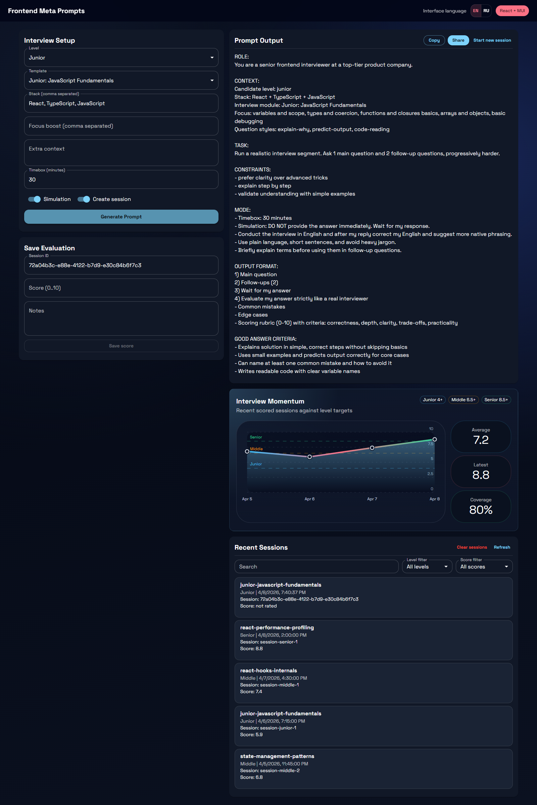

# Frontend Meta Prompts Engine

[](#)
[](#)
[](#)
[](#)

Structured interview engine for Senior Frontend Engineers
(React, TypeScript, JavaScript, System Design)

Live Demo: https://volkov85.github.io/frontend-meta-prompts/

<p align="center">
  
</p>

This project helps you run a repeatable interview practice loop:

1. Generate a structured interview prompt
2. Run interview in external LLM/chat
3. Save score and notes back to local session history

## Why this project exists

Interview prep is usually random and hard to track.
This project makes it structured:

- Template-driven interview topics
- Shared prompt composition core for CLI and Web UI
- Session history persistence
- External evaluation recording (LLM/interviewer score + notes)

## Architecture

```text
data/
  interviews.json    # Interview templates and defaults
  sessions.json      # Runtime session history for CLI mode

core/
  composeInterviewPrompt.ts  # Shared prompt builder (single source of truth)
  types.ts                   # Shared interview domain types

engine/
  composeInterviewPrompt.ts  # Re-export of shared prompt builder for CLI imports
  sessionRunner.ts           # Session create/update and persistence
  scorer.ts                  # Optional local scorer (not required by CLI flow)

index.ts              # CLI entry point

web-ui/
  src/lib/composePrompt.ts   # Re-export of shared prompt builder for browser mode
  src/lib/types.ts           # Re-export of shared core types for the UI layer
  src/lib/localSessions.ts   # localStorage session persistence
  src/App.tsx                # React UI
```

Separation of concerns:

- Data layer: declarative interview templates
- Core layer: shared prompt generation and domain types
- Engine layer: CLI runtime and filesystem persistence
- Web layer: browser UI and localStorage persistence
- Runtime layer: generated sessions and evaluation results

## Features

- Structured interview templates (junior/middle/senior)
- Prompt generation with mode overrides from a shared core module
- Bilingual prompt generation (`en` / `ru`) in Web UI
- Template-level prompt overrides (`promptOverrides`) for per-template tuning
- CLI to list templates and generate interviews
- CLI mode to record external LLM evaluation
- Session persistence in JSON (CLI) and `localStorage` (Web UI)
- Interview progress chart in Web UI with recent scores, averages, and coverage

## Shared Core

The project uses a shared `core/` module so CLI and Web UI do not duplicate
prompt-building logic or domain types.

What lives in `core/`:

- `core/composeInterviewPrompt.ts` - canonical prompt builder
- `core/types.ts` - canonical interview config and session types

Benefits:

- One source of truth for prompt generation behavior
- Consistent output across CLI and browser flows
- Lower maintenance cost when adding new template options or modes

## Template Prompt Overrides

Templates in `data/interviews.json` can define `promptOverrides`:

- `followUps` - overrides default follow-up count
- `include` - overrides default output sections
- `plainLanguage` - forces simpler wording and shorter phrasing
- `goodAnswerCriteria` - adds explicit "GOOD ANSWER CRITERIA" block to output

Example:

```json
{
  "id": "junior-javascript-fundamentals",
  "promptOverrides": {
    "followUps": 2,
    "plainLanguage": true,
    "include": ["idealAnswer", "commonMistakes", "edgeCases", "scoringRubric"],
    "goodAnswerCriteria": ["Explains solution in simple, correct steps"]
  }
}
```

Junior templates (`junior-*`) now use softer defaults:

- fewer follow-ups (`2`)
- plain language enabled
- explicit good answer criteria
- reduced include sections (without senior-focused blocks)

## Getting Started

Install:

```bash
npm install
```

Run CLI help:

```bash
npm run interview -- --help
```

Run Web UI in dev mode:

```bash
npm run web
```

Then open `http://localhost:5173`.

Format code:

```bash
npm run format
```

Run full local quality gate:

```bash
npm run check
```

## CLI Usage

### 1) Generate interview prompt

Creates a new session (unless `--no-session`) and prints prompt.

```bash
npm run interview -- --template js-deep-dive-core --level senior
```

Optional flags:

- `--stack react,typescript,javascript`
- `--focus event-loop,closures`
- `--extra "Your company/project context"`
- `--simulation true|false`
- `--timebox 30`
- `--english`
- `--no-session`

### 2) Record external evaluation

Use this after interview is completed in external LLM/chat.

```bash
npm run interview -- --record-eval --session-id <id> --score 8.5 --notes "Strong trade-offs, missed edge cases"
```

Rules:

- `--record-eval` requires `--session-id`
- `--record-eval` requires `--score` (0..10)
- `--notes` is optional and expected to come from external LLM/interviewer

### 3) List templates

```bash
  npm run interview -- --list-templates
```

## Web UI (React + MUI)

The project includes a browser interface powered by React + TypeScript + MUI, built with Vite.
This mode is fully static and GitHub Pages compatible.

Capabilities:

- Select template and level
- Configure stack, focus, context, timebox, simulation mode
- Switch interface language (`EN` / `RU`) in the top bar
- Generate interview prompt in browser in selected language
- Auto-create session id in browser
- Save score + notes into localStorage
- Track recent interview momentum with a score trend chart and summary stats
- View latest local sessions
- Persist selected UI language in localStorage between reloads

Implementation:

- `web-ui/vite.config.ts` - Vite config
- `web-ui/src/App.tsx` - main UI
- `web-ui/src/components/ProgressChartCard.tsx` - scored session trend chart and KPI cards
- `web-ui/src/main.tsx` - frontend entry
- `web-ui/src/theme.ts` - MUI theme
- `web-ui/src/styles.css` - visual theme and layout styles
- `web-ui/src/lib/composePrompt.ts` - Web-facing re-export of shared prompt composition logic
- `web-ui/src/lib/types.ts` - Web-facing re-export of shared interview types
- `web-ui/src/lib/localSessions.ts` - localStorage persistence

Production build:

```bash
npm run web:build
npm run web:preview
```

Then open the preview URL printed in terminal.

GitHub Pages build (repo path base):

```bash
VITE_BASE_PATH=/YOUR_REPO_NAME/ npm run web:build
```

## Testing

The project now includes:

- Unit tests for shared prompt composition logic
- Unit tests for browser session persistence (`localStorage`)
- Integration tests for core React UI flows
- End-to-end tests in a real browser with Playwright

Run test suites:

```bash
npm run test
npm run test:watch
npm run test:ui
npm run test:coverage
```

Run e2e:

```bash
npx playwright install chromium
npm run e2e
npm run e2e:ui
```

## Code Quality Gate

Local checks:

- `npm run typecheck`
- `npm run lint`
- `npm run format:check`
- `npm run test`
- `npm run check` (runs all of the above in sequence)

Git hooks:

- `pre-commit` -> `lint-staged` (ESLint + Prettier on staged files)
- `commit-msg` -> `commitlint` with Conventional Commits rules

## CI/CD (GitHub Actions)

Workflows:

- `CI Quality Gate` (`.github/workflows/ci.yml`)
- `Deploy to GitHub Pages` (`.github/workflows/deploy-pages.yml`)

Pipeline logic:

- Quality gate runs on push and pull request for `main`
- Deploy runs automatically only after successful `CI Quality Gate` on `main`
- Deploy can also be started manually with `workflow_dispatch`

Test files:

- `web-ui/src/lib/composePrompt.test.ts`
- `web-ui/src/lib/localSessions.test.ts`
- `web-ui/src/App.test.tsx`
- `e2e/app.spec.ts`

## End-to-End Flow (recommended)

1. Generate prompt and create session:

```bash
npm run interview -- --template react-performance-profiling --level senior
```

2. Copy prompt into your interview chat with LLM.
3. After interview, take LLM's final score/notes.
4. Save result:

```bash
npm run interview -- --record-eval --session-id <id> --score 8 --notes "Good depth, improve rollout strategy"
```

## Session Example

```json
{
  "id": "uuid",
  "date": "2026-02-26T12:20:55.985Z",
  "templateId": "react-performance-profiling",
  "level": "senior",
  "score": 8.5,
  "notes": "Strong architecture trade-offs"
}
```

## Tech Stack

- TypeScript
- Node.js
- ts-node
- Vite
- Vitest
- React Testing Library
- Playwright
- Prettier
- JSON-driven configuration
